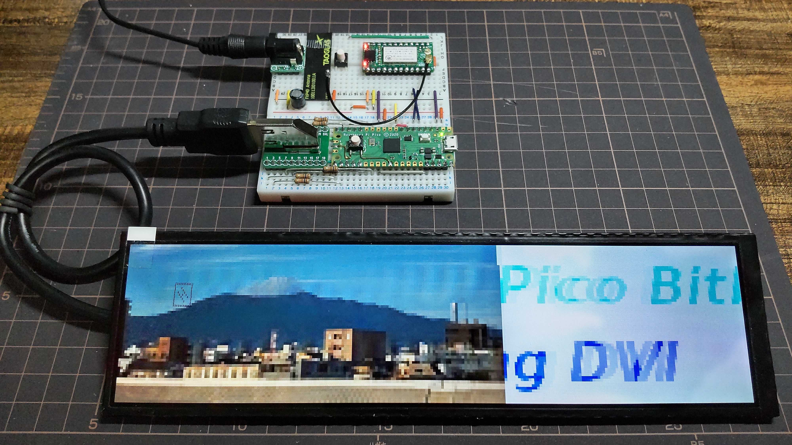
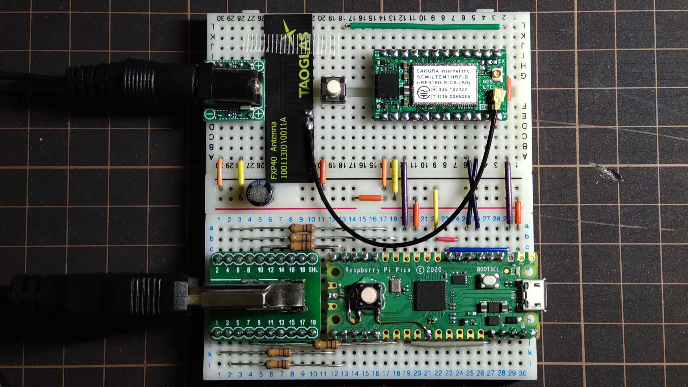
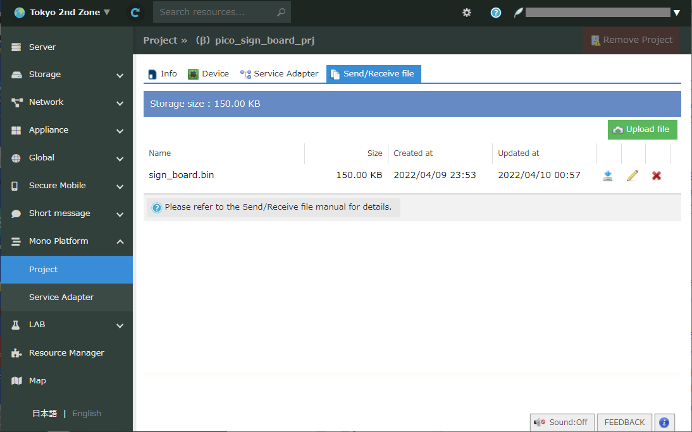

# pico\_sign\_sipf\_xmodem

[README (English)](README.md)



図1 : 480x1920 ディスプレイに画像を横スクロールしながら表示している様子（画像は LTE 経由でアップデート可能）

(画像は http://panoroman.nao3.net/72/img_0485/ を元にしています)

## これは何？

- Raspberry Pi Pico と PicoDVI (https://github.com/Wren6991/PicoDVI) を用いた、画像が横スクロールする電子看板です
- PicoDVI の feat/x8scale ブランチ (https://github.com/homelith/PicoDVI/tree/feat/x8scale) 版を用いることで、60x1280 画像を縦 480 px ディスプレイにフィットするように拡大表示します。これによって raspi pico の限られたメモリで画像保持を可能とします。
- さくらインターネットモノプラットフォームのクラウド API と提供されている評価用 IoT モジュール (SCM-LTEM1NRF) を用いることで、LTE 経由での画像アップデートが可能です

## ハードウェア構築 (ブレッドボードを用いる場合)

- 注意事項
  + DVI 信号出力回路をブレッドボードで作成した場合の信号品質はかなり悪く、動作は不安定です。
  + Pico-DVI-Sock ベースの raspi pico 拡張ボード (https://www.switch-science.com/products/7431) をはんだ付けすることで DVI 信号品質を大きく改善できます。

- 材料
  + Raspberry Pi Pico

  + SCM-LTEM1NRF（さくらインターネット　モノプラットフォーム　評価モジュール）
    * 現在のところ、法人格を持つ日本国内の開発者ならば https://iot.sakura.ad.jp/request_platform_devkit/ から開発キット１つの無償支給を受けられます。
    * 開発キットは https://na-s.stores.jp/items/639927bd940f3d50b7c5a011 などでも購入可能です。
    * 開発キット nRF9160 にはさくらインターネットの標準ファームウェア (https://github.com/sakura-internet/sipf-std-client_nrf9160) が書き込み済みであることとします
    * sipf-std-client_nrf9160 v0.4.1 (https://github.com/sakura-internet/sipf-std-client_nrf9160/releases/tag/v0.4.1) にて動作検証されています

  + Hannstar HSD088IPW1 + HDMI-HSD088-V05 480x1280 縦長ディスプレイ
    * shigezone (https://www.shigezone.com/product/slimlcd/) ショップにて入手可能
    * HDMI-HSD088-V05 上の 5V 供給用ジャンパを短絡させることで HDMI ケーブルを通してディスプレイに 5V を供給可能です
    * **注意** : ディスプレイの消費電力は HDMI 規格の 50mA をはるかに超えており、 ケーブルによっては発煙・発火等の恐れがあります。ケーブルごとに自己責任でテストしてから使用ください。
    * 表示領域が小さくなりますが、640x480 の VGA ディスプレイでも代用可能です。`sw/app/main.c` の PicoDVI 設定パラメータを変更して使用してください。

  + HD03VLP20D HDMI コネクタピンのブレイクアウトボード
    * aitendo (https://www.aitendo.com/product/19221) ショップにて入手可能

  + 2A 以上の出力が可能な 5V AC アダプタ
  + DVI 信号に入れる 10 ~ 100 オーム程度のダンパー抵抗数個
  + 押しボタンスイッチ数個
  + 配線用のジャンパワイヤ

- 配線図は [docs/breadboard-sch.pdf](doc/breadboard-sch.pdf) にあります。



図2: ブレッドボード上に配線した様子

## ソフトウェア構築

- 環境準備
  + Linux ベースの OS 各種上でコンパイル可能と想定 (x86_64 ネイティブの ubuntu 22.04 LTS と WSL2 上の ubuntu 22.04 LTS で試験済)
  + パッケージインストール : `sudo apt install git gcc make cmake gcc-arm-none-eabi libnewlib-arm-none-eabi build-essential golang`

- uf2 バイナリをコンパイルする手順
  + 下記手順でコンパイル後、`sw/build/app/pico_sign_board.uf2` が得られます

```
$ git clone --recursive git@github.com:homelith/pico_sign_sipf_xmodem.git
$ cd pico_sign_sipf_xmodem/sw
$ make
```

- 表示用イメージを送信用フォーマットに変換する作業
  + 幅 60 x 高さ 1280 ピクセル（縦長であることに注意してください）の画像を ${FILENAME}.png の名前で用意してください
  + 変換後、生成ファイルサイズはジャスト 153600 バイトになることを確認してください

```
$ cd pico_sign_sipf_xmodem/sw/tools/png2array
$ make
$ ./png2array -m rgb565 -f bin ${FILENAME}.png > ${FILENAME}.bin
```

## デバイスを動作させる手順

- Raspberry Pi Pico への uf2 ファイルダウンロード
  + BOOTSEL ボタンを押しながら Raspi Pico の電源を投入することで、USB ポートがマスストレージデバイスとして認識されます
  + `pico_sign_board.uf2` ファイルを該当ストレージの直下に置くことで書き込みとセルフリセットが行われます
  + 画面に "Pico Bitbang DVI" のデフォルトイメージが表示され、スクロールが始まることを確認してください

- 看板画像のアップデート
  + 予め SCM-LTEM1NRF モジュールとその SIM をさくらのクラウドモノプラットフォームのプロジェクト、及び WebSocket サービスアダプタに紐づけた状態にしておいてください
  + 「プロジェクト」タブから ${FILENAME}.bin をモノプラットフォームの保存ファイルリストにアップロードしてください（図３）
  + 「サービスアダプタ」タブから "メッセージ送信" コマンドを選び、下記パラメータとともに送信してください（図４）
    * タグ：任意の 16 進値（8bit）
    * タイプ：UTF-8 文字列
    * 値："${FILENAME}.bin"
  + Raspi Pico はデフォルトでは 3 分に一回モノプラットフォームに新規メッセージがないかを確認するようになっています。もしくは GP6 ピンを GND に落とすことで即時に確認動作をトリガすることも可能です。
  + Raspi Pico が ${FILENAME}.bin の形の UTF-8 文字列メッセージを受け取ると、xmodem ダウンローダが起動し、 SCM-LTEM1NRF モジュールを通してその文字列をファイル名として解釈したファイルをダウンロードします
  + ダウンロードされたファイルは rgb565 形式として解釈され直接画像バッファに書き込まれます

- 看板のスクロール速度変更
  + デフォルトのスクロール速度は 16 ピクセル毎フレームであり、モノプラットフォームからのメッセージ送信で変更することができます
  + 予め SCM-LTEM1NRF モジュールとその SIM をさくらのクラウドモノプラットフォームのプロジェクト、及び WebSocket サービスアダプタに紐づけた状態にしておいてください
  + 「サービスアダプタ」タブから "メッセージ送信" コマンドを選び、下記パラメータとともに送信してください
    * タグ：任意の 16 進値（8bit）
    * タイプ：int16 型数値
    * 値：{-32768 から 32767 までの数値}
  + Raspi Pico はデフォルトでは 3 分に一回モノプラットフォームに新規メッセージがないかを確認するようになっています。もしくは GP6 ピンを GND に落とすことで即時に確認動作をトリガすることも可能です。
  + Raspi Pico が int16 数値型のメッセージを受け取ると、スクロール速度がその数値分の pixel 数毎フレームになります。



図3: sign\_board.bin をモノプラットフォーム「プロジェクト」タブにアップロードした様子


図4: モノプラットフォーム「サービスアダプタ」タブから、ダウンロードすべき画像ファイル名を記した文字列メッセージを送信する様子
