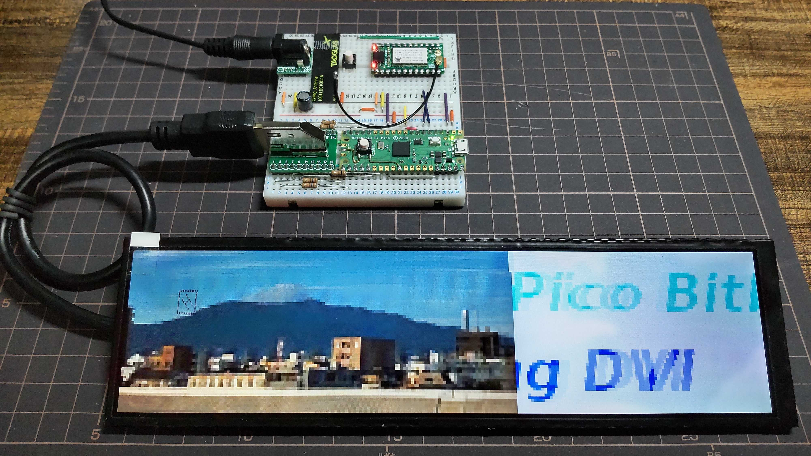
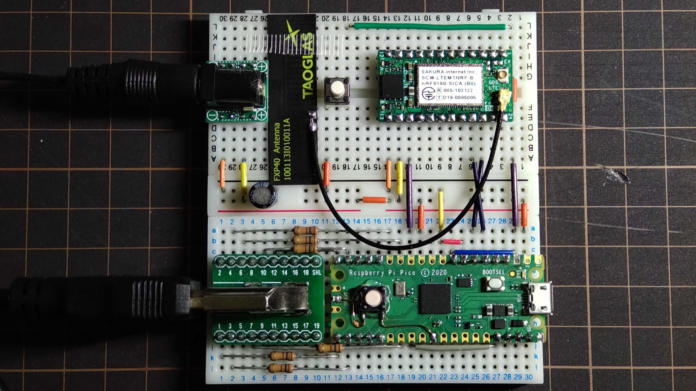
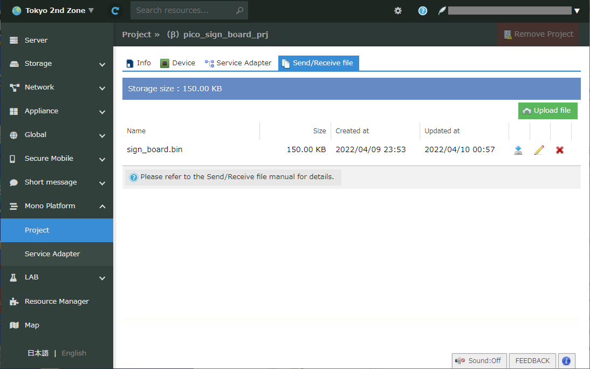
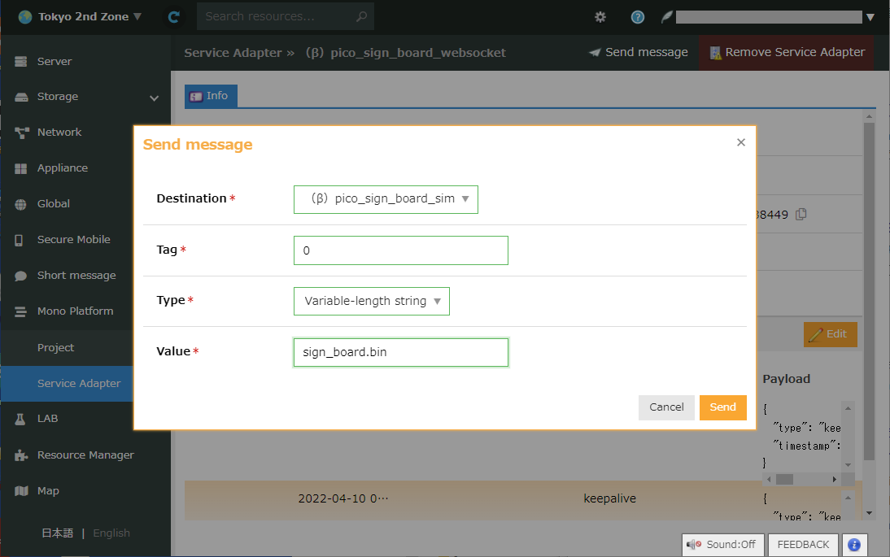

# pico\_sign\_sipf\_xmodem



fig.1: horizontal scrolled image output on 480x1920 display at 20Hz where image can be updated via LTE

(picture on loading derived from http://panoroman.nao3.net/72/img_0485/)

## what is this ?

- show horizontal scrolled signboard on HDMI display, powered by Raspberry Pi Pico and PicoDVI (https://github.com/Wren6991/PicoDVI)
- PicoDVI feat/x8scale modified branch (https://github.com/homelith/PicoDVI/tree/feat/x8scale) enables expanding image 8 times large, saving memory capacity to 60x1280 image that fits limited memory capacity on Raspberry Pi Pico
- signboard image will be updated via LTE, powered by SAKURA internet Mono Platform (https://iot.sakura.ad.jp/platform/) and its client device SCM-LTEM1NRF

## building hardware (breadboard-based)

- note
  + HDMI output tend to be unstable since breadboard has much poor signal transmission characteristics. Pray for success.
  + see [docs/breadboard-sch.pdf](doc/breadboard-sch.pdf) for wiring
  + KiCAD design files are placed on `pcb/breadboard`
  + HDMI pin assignments are compatible with Pico DVI Sock (https://github.com/wren6991/pico-dvi-sock)

- components
  + Raspberry Pi Pico

  + SCM-LTEM1NRF SAKURA internet Mono Platform evaluation module
    * currently anyone belongs to corporate entity can request one via https://iot.sakura.ad.jp/request_platform_devkit/ (they do not ship besides japan)
    * they say development kit with SCM-LTEM1NRF included will be on market at an early date (https://manual.sakura.ad.jp/cloud/iotpf/support.html)
    * assume generic sipf-std-client\_nrf9160 firmware to be installed (https://github.com/sakura-internet/sipf-std-client_nrf9160)
    * tested with firmware on release v0.4.1 (https://github.com/sakura-internet/sipf-std-client_nrf9160/releases/tag/v0.4.1)

  + Hannstar HSD088IPW1 + HDMI-HSD088-V05 480x1280 vertical elongated display
    * currently available on shigezone (https://www.shigezone.com/product/slimlcd/)
    * placing jumper on HDMI 5V supply pin on HDMI-HSD088-V05 helps supplying power via HDMI cable
    * **warning** : this is out of HDMI standard (+5V line current is limited up to 50mA), use thicker and shorter cable or the cable may catch fire. TRY AT YOUR OWN RISK
    * generic 640x480 display can be alternative. To use them, modify PicoDVI parameters on `sw/app/main.c`

  + HD03VLP20D HDMI signal breakout board
    * currently available on aitendo (https://www.aitendo.com/product/19221)

  + 5V DC power sources with 2 amps or more
  + some dumper resisters (e.g. from 10 to 100 ohms) for HDMI signals
  + some tactile switches
  + some jump wires



fig.2: experimental setup on breadboard

## build software

- prepare environment
  + some linux based distros (tested under native ubuntu 20.04 LTS and WSL2 ubuntu 20.04 LTS)
  + `sudo apt install git gcc make cmake gcc-arm-none-eabi libnewlib-arm-none-eabi build-essential golang`

- compile uf2 binary
  + you'll get `sw/build/app/pico_sign_board.uf2` after compilation

```
$ git clone --recursive git@github.com:homelith/pico_sign_sipf_xmodem.git
$ cd pico_sign_sipf_xmodem/sw
$ make
```

- convert source image
  + prepare width 60px x height 1280px image as ${FILENAME}.png
  + confirm generated binary has exactly 153600 bytes of size

```
$ cd pico_sign_sipf_xmodem/sw/tools/png2array
$ make
$ ./png2array -m rgb565 -f bin ${FILENAME}.png > ${FILENAME}.bin
```

## run on device

- download uf2 on Raspberry Pi Pico
  + power on Pico with BOOTSEL button pressed to make Pico run on USB mass storage device mode
  + place `pico_sign_board.uf2` file on Pico-emulated USB storage root directory
  + you will see "Pico Bitbang DVI" sample images scrolled horizontally

- update signboard image
  + assume SCM-LTEM1NRF module associated with a Mono Platform project and websocket service adapter on your SAKURA Cloud account.
  + From project tab, upload ${FILENAME}.bin to associated project (fig.3)
  + From service adapter tab, issue "send message to device" command (fig.4)
    * parameters :  tags;{any 8bit hex value}, type;variable length string, value;${FILENAME}.bin
  + Pico polls any new messages on every 3 minites by default or you can trigger it immediately by pressing tactile switch to drive Pico GP6 pin to GND.
  + Once Pico found new messages with ${FILENAME}.bin, xmodem downloader will be initiated and the image will be updated consequently.



fig.3: upload sign\_board.bin on SAKURA Mono Platform project tab



fig.4: sending message on SAKURA Mono Platform service adapter tab, notifying device filename to be downloaded
